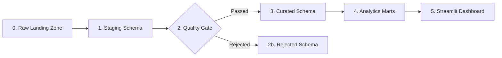

# System Architecture & Technical Design

## 1. Executive Summary
The **Hospital Readmission Analytics Platform** provides a reproducible, end-to-end data engineering architecture designed for hospital readmission analytics. Using the public **UCI Diabetes 130-US Hospitals (1999–2008)** dataset, it implements a disciplined healthcare data platform with cryptographic patient de-identification, deterministic data cleaning, formal data quality gating, relational PostgreSQL storage, and an interactive Streamlit dashboard.

The architecture serves as **Part 1** of a two-part Data Engineering and MLOps curriculum, establishing a solid foundation for **Part 2: Predictive Readmission Modeling**.

---

## 2. Multi-Tier Data Lakehouse Architecture



### Layer 0: Raw Landing Zone (`data/raw/`)
- **Immutability Principle:** Raw files (`diabetic_data.csv`, `IDs_mapping.csv`) are strictly read-only and never mutated in place.
- **Audit Logging:** Every file is verified by calculating file size, row count, column count, and a cryptographic **SHA-256 checksum**, persisted to `metadata.etl_ingestion_log`.

### Layer 1: Staging Layer (`staging.diabetic_encounters`)
- **Preservation:** Ingests the 50 raw columns exactly as provided by the data provider with text types to avoid destructive type coercion before auditing.
- **Audit Columns:** Appends `pipeline_run_id` and `staged_at` UTC timestamps.

### Layer 2: Quality & Validation Gate (`validate_data.py`)
- **Gatekeeper:** Applies 18 formal Data Quality (DQ) rules.
- **Quarantine:** Encounters violating critical checks (e.g. duplicate IDs, missing primary keys, out-of-bounds metrics) are quarantined in `rejected.encounters` with explicit reason codes (`DUPLICATE_ENCOUNTER_ID`, `INVALID_TIME_IN_HOSPITAL_BOUNDS`).

### Layer 3: Curated Relational Layer (`curated.*`)
- **Privacy Shield:** Generates salted surrogate hashes:
  $$\text{patient\_key} = \text{SHA-256}(\text{patient\_nbr} + \text{salt})$$
  The original `patient_nbr` is completely excluded from downstream relational schemas.
- **Relational Decomposition:**
  - `curated.encounters`: Core encounter demographics and encounter-level metrics.
  - `curated.diagnoses`: Unpivoted primary, secondary, and tertiary ICD-9 codes with categorized clinical groupings (`Circulatory`, `Respiratory`, `Diabetes`, etc.).
  - `curated.admissions`: Intake route, discharge destination, and prior healthcare utilization.
  - `curated.readmissions`: Standardized readmission target (`<30`, `>30`, `NO`) and binary `readmitted_30d`.

### Layer 4: Analytical Data Marts (`analytics.*`)
- Pre-aggregated dimensional tables designed for $O(1)$ sub-second query latency on executive dashboards without re-scanning millions of relational joins:
  - `analytics.patient_summary` (1 row per unique patient key)
  - `analytics.readmission_summary` (by age, gender, race, admission type)
  - `analytics.admission_summary` (by admission type, source, disposition)
  - `analytics.diagnosis_summary` (by ICD-9 category and position)
  - `analytics.length_of_stay_summary` (by hospital days)

### Layer 5: Presentation Tier (`dashboard/app.py`)
- Interactive Streamlit application with Plotly visualizations, responsive filters, KPI cards, and observational cohort rankings.

---

## 3. Database Schema & Indexing Strategy

To guarantee rapid filtering and join performance across 100,000+ encounters, B-Tree indexes are applied to high-cardinality foreign keys and analytical filter dimensions:
- `curated.encounters(patient_key)`: Optimizes multi-encounter patient history queries.
- `curated.encounters(readmitted_30d)`: Accelerates readmission rate aggregations.
- `curated.encounters(age_group, admission_type)`: Powers interactive dashboard cohort slicing.
- `curated.diagnoses(encounter_key, diagnosis_category)`: Accelerates ICD-9 clinical category lookups.

---

## 4. Future Part 2 MLOps Extension Blueprint

Part 1 is intentionally designed with clean architectural boundaries to transition directly into Part 2:

```
Part 1 (Current Data Engineering)                Part 2 (Future MLOps Extension)
---------------------------------                -------------------------------
analytics.patient_summary   ---------\
curated.encounters          ----------> Feature Store (Feature Views & Offline Train Sets)
curated.diagnoses           ---------/              │
                                                    ▼
                                            Model Training Pipeline
                                            (LogReg, Random Forest, XGBoost)
                                                    │
                                                    ▼
                                            Experiment Tracking (MLflow)
                                            (ROC-AUC, Precision-Recall, F1)
                                                    │
                                                    ▼
                                            Model Registry & Validation
                                            (Fairness Audit & Staging Promotion)
                                                    │
                                                    ▼
                                            Real-Time Inference API
                                            (FastAPI Container)
                                                    │
                                                    ▼
                                            Streamlit Patient Risk Scorecard
```

### Clean Boundary Deliverables for Part 2:
1. **Training Dataset Extraction Query:** Built into `sql/05_analytics_queries.sql`, extracting `curated.encounters` joined with patient summary historical utilization.
2. **Deterministic Preprocessing:** `src/transformation/clean_data.py` and `standardization.py` can be packaged into scikit-learn transformers or an offline feature pipeline.
3. **Target Label Definition:** The binary variable `readmitted_30d` is mathematically verified and standardized across all marts.
